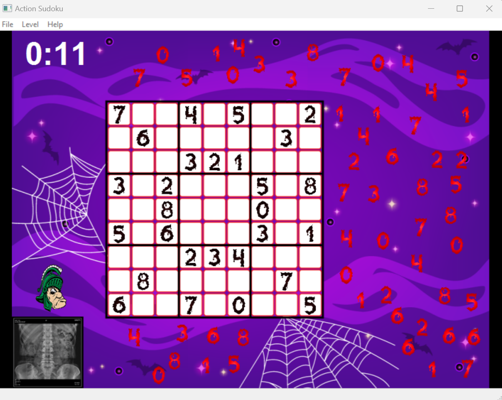

# Sudoku Game  

## Overview  
The **Sudoku Game** is a C++ application that combines logic and creativity to deliver a dynamic and engaging take on traditional Sudoku puzzles. Built with an object-oriented design, the program features custom classes for managing the game board, user interactions, and visual elements. It includes unique components such as a scoreboard, themed visuals, and specialized mechanics for an enhanced player experience.  



---

## Features  
- **Classic Sudoku Gameplay**: Solve puzzles by filling in digits while adhering to Sudoku rules.  
- **Custom Themes and Visuals**: Includes unique elements like Sparty Head, X-ray effects, and custom backgrounds.  
- **Interactive UI**: Features interactive components such as containers, digits, and a scoreboard for real-time feedback.  
- **Extensible Design**: Built with modular classes for easy addition of new features or game modes.  

---

## How It Works  

### **What**  
The game challenges players to solve Sudoku puzzles with additional interactive and visual enhancements.  

### **How**  
- The game is structured around object-oriented principles, with a set of modular classes that manage different aspects of the game:  
  - **Visual Components**: Backgrounds, digits, givens, and themed elements like Sparty Head.  
  - **Game Logic**: Tracks player progress, manages givens, and checks Sudoku rules.  
  - **User Interaction**: Handles clicks, drags, and other inputs for a smooth gameplay experience.  
- The game leverages `wxWidgets` for creating the user interface, rendering visuals, and managing events.  

### **Outcome**  
Provides a visually appealing, intuitive, and interactive Sudoku experience that stands out from traditional implementations.  

---

## Class Structure  

### Declarations (`CDeclarations`)  
The program includes the following primary classes, each serving a distinct role:  

- **Visual and Logic Components**:  
  - `CBackgroundDec`, `CContainerDec`, `CDigitsDec`, `CGivensDec`, `CSpartyHeadDec`, `CXrayDec`  
    - Handle background, container, digit, given, and themed decorations.  
  - `CItem`: Base class for visual components.  

- **Game Entities**:  
  - `CBackground`: Manages background visuals.  
  - `CContainer`: Handles the container for Sudoku grid and other components.  
  - `CDigits`: Represents the playable digits on the Sudoku board.  
  - `CGivens`: Manages fixed digits (givens) on the grid.  
  - `CScoreboard`: Tracks and displays player scores.  
  - `CSpartyHead`: Themed visual element for Michigan State University fans.  
  - `CXray`: Special effect to enhance gameplay visuals.  

- **Gameplay Logic**:  
  - `CItemVisitor`: Visitor pattern class for interacting with game items.  
  - `CDigitEater`: Specialized class for unique gameplay mechanics (e.g., digit removal).  
  - `CLevel`: Manages game levels and progression.  
  - `CSudoku`: Core class for Sudoku puzzle logic.  

- **UI Components**:  
  - `CwxFrame`, `CMainFrame`: Manage the main application window and layout.  
  - `CwxWindow`: Base class for UI components.  
  - `CSudokuView`: Handles rendering and display of the Sudoku grid.  

---

## Prerequisites  

To run this program, you’ll need:  
- **C++ Compiler**: Ensure you have a compiler like `g++` or `clang` installed.  
- **wxWidgets Library**: Install wxWidgets for GUI support.  
  - For example, on Linux:  
    ```bash
    sudo apt-get install libwxgtk3.0-gtk3-dev
    ```  
  - On macOS:  
    ```bash
    brew install wxwidgets
    ```  
  - On Windows, follow wxWidgets installation instructions from [here](https://www.wxwidgets.org/downloads/).  

---

## Installation and Usage  

### Clone the Repository  
Clone the repository to your local machine:  
```bash  
git clone https://github.com/your-username/Sudoku-Game.git  
cd Sudoku-Game  
